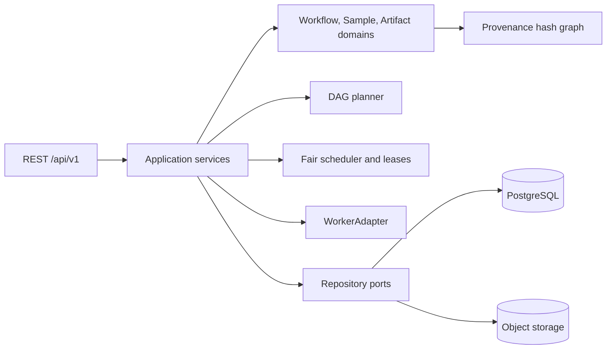

# Architecture

```mermaid
flowchart LR
  API[REST /api/v1] --> App[Application services]
  App --> Domain[Workflow, Sample, Artifact domains]
  App --> Planner[DAG planner]
  App --> Scheduler[Fair scheduler and leases]
  App --> Worker[WorkerAdapter]
  Domain --> Prov[Provenance hash graph]
  App --> Repo[Repository ports]
  Repo --> DB[(PostgreSQL)]
  Repo --> Objects[(Object storage)]
```

The domain layer is independent of HTTP, database and vendor SDKs. Worker and storage integrations are ports with deterministic in-memory adapters for local execution.
